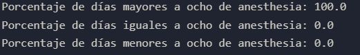

# Proyecto Individual #2 Facundo Martín Corengia | Bootcamp SoyHenry

---

## Índice

1. Introducción
2. Trabajo a realizar
3. Procedimiento
4. Conclusión

---

## Introducción

Hola, me llamo Facundo Martín Corengia. La finalidad de este repositorio es explicar mi Proyecto Individual del Bootcamp SoyHenry enfocado en la rama de Data Scientist/Machine Learning.

---

## Trabajo a realizar

En este proyecto, enfocado al area de la Salud, nos dieron la tarea de predecir si un paciente tendrá una estadía prolongada o no (que esté más de ocho días en el hospital) teniendo en cuenta distintos parámetros del mismo. Nos otorgaron dos archivos que contienen la información de los pacientes, uno para entrenar nuestro modelo de Machine Learning y otro para realizar pruebas al mismo . Los distintos datos que tenemos relacionados al paciente y a su estadía son: 

- Available Extra Rooms in Hospital: Habitaciones adicionales disponibles en el hospital. Una habitación no es igual a un paciente, pueden ser individuales o compartidas.
- Department: Área de atención a la que ingresa el paciente.
- Ward_Facility_Code: Código de la habitación del paciente.
- doctor_name: Nombre de el/la doctor/a a cargo del paciente.
- staff_available: Cantidad de personal disponible al momento del ingreso del paciente.
- patientid: Identificador del paciente.
- Age: Edad del paciente.
- gender: Género del paciente.
- Type of Admission: Tipo de ingreso registrado según la situación de ingreso del paciente.
- Severity of Illness: Gravedad de la enfermedad/condición/estado del paciente al momento del ingreso.
- health_conditions: Condiciones de salud del paciente.
- Visitors with Patient: Cantidad de visitantes registrados para el paciente.
- Insurance: Indica si la persona posee o no seguro de salud.
- Admission_Deposit: Pago realizado a nombre del paciente, con el fin de cubrir los costos iniciales de internación.
- Stay (in days): Días registrados de estancia hospitalaria.

En este trabajo, es necesario realizar un EDA (Análisis Exploratorio de Datos) para posteriormente generar una predicción de cuántos días se va a quedar la persona.

Para corroborar la eficacia de esta predicción, vamos a tener en cuenta dos métricas: Recall y Accuracy. Accuracy hace referencia a el ratio entre las predicciones correctas (suma de verdaderos positivos y verdaderos negativos) y las predicciones totales. Mientras que Recall mide qué tan bien el modelo es capaz de identificar todas las observaciones positivas verdaderas en el conjunto de datos. Esto es importante porque un modelo con un bajo recall puede fallar en detectar algunas observaciones positivas verdaderas, lo que puede tener consecuencias graves en ciertas aplicaciones.

---

## Procedimiento

En este proyecto, me enfoqué en dos cosas: en el EDA y en encontrar los mejores parámetros para el modelo de predicción que elegí. El modelo elegido fue el Decision Tree Classifier, que pude utilizarlo gracias a la librería Scikit-Learn.  El EDA fue desarrollado de la siguiente manera: fui buscando patrones en las distintas columnas para poder determinar si cuando sucede cierta condición la persona tiene una estadía prolongada (de más de 8 días). También, para poder generar las predicciones, tuve que transformar la columna ‘Stay (in days)’ a 0 o 1, siendo 0 si una persona se queda 8 o menos días y 1 si se queda más de 8 días. Luego del análisis, encontré bastante información a tener en cuenta:

- Si hablamos de la columna Department, nos damos cuenta de que cuando nos referimos tanto a Anesthesia como a Surgery, los pacientes tienen casi un 100% de probabilidades de quedarse más de 8 días. También, el departamento de TB & Chest disease tiene un porcentaje bastante alto de 96.5%.

Probabilidad de que un paciente se quede más, menos o ocho días si se atiende en el departamento de anesthesia.

Probabilidad de que un paciente se quede más, menos o ocho días si se atiende en el departamento de surgery.

Probabilidad de que un paciente se quede más, menos o ocho días si se atiende en el departamento de TB & Chest disease.

En este caso, tenemos bastante claro que los pacientes que asisten al departamento de anesthesia van a estar más de 8 días, por lo que podríamos determinarlo poniendo un 1 en la columna ‘Stay (in days)’ cuando eso pase. Pero para las otras dos áreas anteriormente mencionadas esto no queda tan claro, si bien surgery tiene un 99.95% y se podía determinar que los pacientes del área siempre van a tener una estadía prolongada sin llegar a malograr los datos. Con el área TB & Chest disease no queda todo tan claro, ya que el 96.5% de los pacientes son los que van a estar más de 8 días y el otro 3.5% va a estar o 8 días o menos. Para resolver esta problemática pueden surgir dos caminos, o se toma ese porcentaje que falta para el 100% como Falsos Positivos o se deja los datos como están. Yo soy partidario a dejar los datos como están, aunque también es algo que se tiene que probar en el modelo de predicción y sus respectivas métricas.

- Si nos referimos a la columna ‘Age’, nos damos cuenta de que los pacientes que tienen entre 0 a 10 años o más de 51, SIEMPRE te vas a quedar más de ocho días en el hospital, independientemente de el departamento o de la causa de la visita.

Nos damos cuenta de la información de la columna Age con esta imágen, el primer valor de la lista hace referencia a la probabilidad de quedarse más de 8 días. Y vemos que estos rangos etarios siempre se quedan esa cantidad de tiempo

- También, según lo visto en el la columna ‘doctor_name’: Si el paciente es atendido por el Dr.Mark, Dr.Isaac o el Dr.Simon tiene más de un 98% de probabilidades de quedarse más de ocho días.
    
    
    
    Porcentaje de que un paciente se quede más, menos o 8 días si te atiende el Dr.Simon.
    
    
    
    Porcentaje de que un paciente se quede más, menos o 8 días si te atiende el Dr.Mark.
    
    
    
    Porcentaje de que un paciente se quede más, menos o 8 días si te atiende el Dr.Isaac.
    
    En este caso también se pueden tomar dos caminos, el de dejar los valores como están o completar hasta el 100% con Falsos Positivos, creo que primero hay que probar el modelo y después intentarlo con los Falsos Positivos para ver si mejora el Recall o el Accuracy
    
- Hablando de la columna ‘gender’, solo Female asiste a ginecology y si bien asisten muchas personas, sus estadías son más cortas con respecto a las otras áreas.
- También, me pareció correcto borrar algunas columnas que creo que, ya sea por sentido común o después de analizarlas deben ser eliminadas, estas son:
    - La columa **'Visitors with Patient'** ya que creo que la cantidad de personas que visitan al paciente no determinan realmente cuánto tiempo va a estar la persona.
    - La columna **'Admission_Deposit'**, ya que no existe una correlación realmente entre esta columna y los días que un paciente se va a quedar en el hospital. Esto puede llegar a verse por ejemplo si compararamos datos de un hospital público y otro privado, pero en este caso estamos analizando un hospital privado.
    Si es eliminada la columna 'Admission_Deposit' entonces eso significa que ni el pagar ni tener una buena obra social/seguro médico te pueden llegar a ayudar a que estés menos tiempo en el hospital, puede ayudar, pero siempre va a ser más importante los síntomas y el área en el que te atiendas, por lo que también voy a eliminar la columna **'Insurance'** ya que la misma hace referencia a si el paciente tiene o no seguro médico/obra social y como vimos no tiene correlación.
    - La columna **'Ward_Facility_Code'**, ya que esta hace referencia al código de ingreso a la habitación del paciente, y creo que eso no tiene ninguna relación con que un paciente
    #se quede más o menos días. También puede llegar a afectar el modelo, teniendo en cuenta esos datos cuando en realidad no es la idea por lo que se mencionó anteriormente.
    - La columna **'patientid'**, ya que el id que puede llegar a tener un paciente en su hospital no influye en nada en cuánto tiempo tendría que quedar.

Luego de ese análisis finalizó mi EDA, ahora es el momento de probar el modelo de Machine Learning de Decision Tree Classifier.

Antes de poder utilizar el modelo, es importante pasar los datos categóricos u ordinales a 0 y 1, para eso existen varias funciones tanto en Pandas como en Scikit-Learn. Utilicé varias al momento de probar el modelo, pero la que mejor puntuación me dió fue ‘get_dummies’ de Pandas.

Probé diferentes funciones para pasar datos categóricos a binario, OneHotEncoder y LabelEncoder de Sklearn, Label Encoder y también get_dummies, la mayoría contaba con un comportamiento similar, pero el más acertado y el que mejor Recall y Accuracy otorgó fue get_dummies. En cuanto al modelo, el mejor Accuracy y Recall que conseguí fue con la profundidad del árbol en 18, con test_size en 0.30. Esto me otorgó un 0.697 de Accuracy y 0.848 de Recall.

Luego de eso, decidí probar si el agregar Falsos Positivos a las columnas que estaban muy cerca de tener un 100% de probabilidades de que el paciente se quede más de 8 días. Después de probar me dí cuenta de que sí mejoró, con una profundidad menor (17) y un test_size igual, conseguí 0.699 de Accuracy y un 0.849 de Recall, lo que mejoró el modelo. 

---

## Conclusiones

Creo que este proyecto esta muy interesante, tanto la parte del EDA como la creación y prueba del modelo. El probar cosas y mejorar métricas es algo muy divertido.